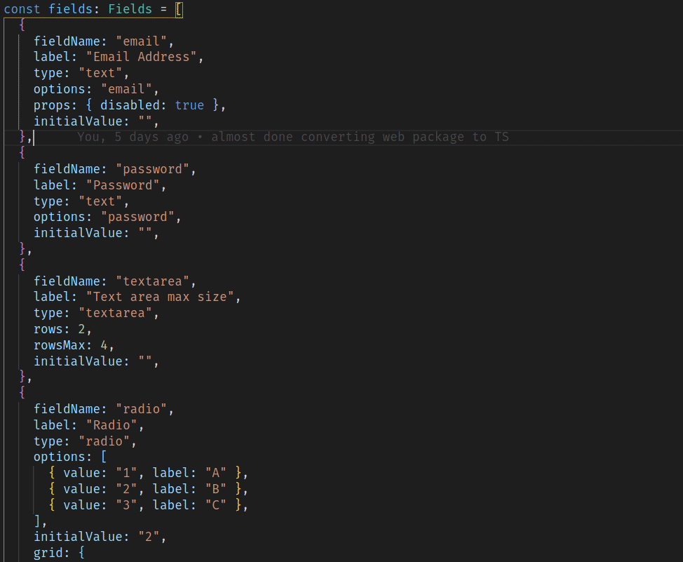

# EZ-FormikUI

#### Easy form generator using Formik, MaterialUI, Google Recaptcha and Axios.

An easy way to generate forms using json like objects.



# Links

- [Installation](#installation)
- [Usage](#usage)
- [Examples](#examples)
- [Config](#config)
  - [Captcha Key](#captchakey)
  - [Text](#text)
  - [Config Setup](#config-setup)
- [Props](#props)
- [Fields Props](#fields)
  - [Array](#array)
  - [Autocomplete](#autocomplete)
  - [Checkbox](#checkbox)
  - [Dates](#dates)
  - [Other](#other)
  - [Radio](#radio)
  - [Select](#select)
  - [Switch](#switch)
  - [Textarea](#textarea)
  - [TextField](#textfield)

## Installation

npm:

```bash
npm install ez-formikui
```

yarn:

```bash
yarn add ez-formikui
```

## Usage

```JSX
import EZFormikUI from "ez-formikui";

const Example = () => {
  return (
    <EZFormikUI
      fields={
        {
          fieldName: "email",
          label: "Email Address",
          type: "text",
          options: "email",
          props: { disabled: true },
          initialValue: ""
        },
        {
          fieldName: "password",
          label: "Password",
          type: "text",
          options: "password",
          initialValue: ""
        }
      }
      title="EZ-FormikUI"
      paragraph="Easy form generator"
      onSubmit={values => alert(JSON.stringify(values, undefined, 4))}
      validate={values => {
        const errors = {};

        if (values.custom > 2) {
          errors.custom = "No more then 2!";
        }

        return errors;
      }}
    />
  );
};
```

## Examples

[JS Example](examples/example.js)  
[TS Example](examples/example.tsx)  
[](https://codesandbox.io/s/ez-formikui-example-ivkvu?fontsize=14&hidenavigation=1&theme=dark)

## Config

General [config](src/config/index.ts) that the form uses.

```JSX
const config = {
  captchaKey: "",
  text: {
    checkCaptcha: "Check the box!",
    submit: "Submit",
    selectEmpty: "None",
    addNewItem: (name: string) => `Add new ${name}`,
  },
};

export default config;
```

#### captchaKey

If you want to use captcha in your forms [register to get captcha key](http://www.google.com/recaptcha/admin) and [set up you're key](#config-setup)

#### text

Default text that the form will use. [here](#config-setup) you can change it.

### Config Setup

To change the config import the `setCaptchaKey, changeText` from the package.

**Example:**

```JSX
import React from "react";
import { setCaptchaKey, changeText } from "ez-formikui";

const captchaKey = "<You're captcha key>";
const textObj = {
    checkCaptcha: "Check the box!",
    submit: "Submit",
    selectEmpty: "Clear Selection",
    addNewItem: (name: string) => `Add new ${name} to the array.`,
};

setCaptchaKey(captchaKey);
changeText(textObj);

export default function App() {
  return (
    ...
  );
};
```

## Props

|        Name        |                          Type                           |      Required      | Default                                                                                             | Description                                                                                                                                                                                                                                                                                                                                                                                                                                           |
| :----------------: | :-----------------------------------------------------: | :----------------: | --------------------------------------------------------------------------------------------------- | ----------------------------------------------------------------------------------------------------------------------------------------------------------------------------------------------------------------------------------------------------------------------------------------------------------------------------------------------------------------------------------------------------------------------------------------------------- |
| [fields](#fields)  |            [FieldType\[\]\(array\)](#fields)            | :heavy_check_mark: |                                                                                                     | an array of fields to be generated in the form.                                                                                                                                                                                                                                                                                                                                                                                                       |
|       title        |                         string                          |        :x:         |                                                                                                     | adds title to the form.                                                                                                                                                                                                                                                                                                                                                                                                                               |
|     paragraph      |                         string                          |        :x:         |                                                                                                     | adds paragraph to the form.                                                                                                                                                                                                                                                                                                                                                                                                                           |
|  validationSchema  | [yup validation schema](https://github.com/jquense/yup) |        :x:         |                                                                                                     | validates your form with yup schema                                                                                                                                                                                                                                                                                                                                                                                                                   |
|      validate      |                          func                           |        :x:         |                                                                                                     | a function to validate your form <br>**signature:**<br> <pre lang="javascript">(values: object) => object </pre>                                                                                                                                                                                                                                                                                                                                      |
|      onSubmit      |                     func \| string                      | :heavy_check_mark: |                                                                                                     | a function / url to submit your form <br>if string is provided the values will be submitted to the given url (default request method is post, can be changed with submitMethod prop).<br>if function is provided then the function will be called upon submit (the function will be wrapped automatically in try catch block to handle errors) <br> **signature:**<br> <pre lang="javascript">(values: object, actions: FormikHelpers) => void </pre> |
|    submitMethod    |          get \| delete \| put \| patch \| post          |        :x:         | `post`                                                                                              | HTTP request method to send the form data (only works if the onSubmit prop is a string)                                                                                                                                                                                                                                                                                                                                                               |
| afterDefaultSubmit |                          func                           |        :x:         |                                                                                                     | a function to execute after default submit (only executed if onSubmit prop is a string). <br>**signature:**<br> <pre lang="javascript">(res: AxiosResponse, actions: FormikHelpers) => void </pre>                                                                                                                                                                                                                                                    |
|     useCaptcha     |                         boolean                         |        :x:         | `false`                                                                                             | if set to true the form will use google recpatcha v2 (note that to use this feature you will need to [set up captcha key](#captchakey))                                                                                                                                                                                                                                                                                                               |
|     gridProps      |                         object                          |        :x:         | {<br> alignItems: "center",<br> direction: "row",<br> justify: "space-between",<br>spacing: 1,<br>} | [MaterialUI](https://material-ui.com/) [Grid props](https://material-ui.com/api/grid/) to be applied to the fields div container                                                                                                                                                                                                                                                                                                                      |
|    submitProps     |                         object                          |        :x:         | {<br>grid:{xs:12}<br>}                                                                              | [props](#submit-props) to apply on the submit button                                                                                                                                                                                                                                                                                                                                                                                                  |

## Fields

The fields of the form.
Checkout the [examples](#examples).

### Array

|  Prop Name   | Type                              |      Required      | Default     | Description                                                                                                     |
| :----------: | --------------------------------- | :----------------: | ----------- | --------------------------------------------------------------------------------------------------------------- |
|     type     | string                            | :heavy_check_mark: |             | the type of the field <br> <sub>needs to be `"array"` in this case</sub>                                        |
|  fieldName   | string                            | :heavy_check_mark: |             | the name of the field<br><sub> note that it needs to be unique and cannot be `"fieldName"` (causes a bug)</sub> |
|    label     | string                            | :heavy_check_mark: |             | the label of the field.                                                                                         |
| initialValue | array                             | :heavy_check_mark: |             | the initialValue of the field.                                                                                  |
|      of      | [FieldType\[\]\(array\)](#fields) | :heavy_check_mark: |             | the fields that will render on each row of the array<br> <sub>note that nested arrays is not supported </sub>   |
|     max      | number                            |        :x:         |             | if provided the array will have max length.                                                                     |
|  startEmpty  | boolean                           |        :x:         | `false`     | if true the array will starts as an empty array.                                                                |
| newItemText  | string                            |        :x:         |             | the text that will render on the add new item button.<br><sub>this will override the default text</sub>         |
|   rowProps   | object                            |        :x:         |             | extra props to pass to the row (style, className, etc...)                                                       |
|    props     | object                            |        :x:         |             | extra props to pass to the component (style, className, etc...)                                                 |
|     grid     | object                            |        :x:         | `{ xs:12 }` | [Grid Sizes object](src/types/InputGrid.d.ts)                                                                   |

### Autocomplete

|  Prop Name   | Type   |      Required      | Default     | Description                                                                                                     |
| :----------: | ------ | :----------------: | ----------- | --------------------------------------------------------------------------------------------------------------- |
|     type     | string | :heavy_check_mark: |             | the type of the field <br> <sub>needs to be `"autocomplete"` in this case</sub>                                 |
|  fieldName   | string | :heavy_check_mark: |             | the name of the field<br><sub> note that it needs to be unique and cannot be `"fieldName"` (causes a bug)</sub> |
|    label     | string | :heavy_check_mark: |             | the label of the field.                                                                                         |
|   options    | array  | :heavy_check_mark: |             | the options of the component <br> <sub> needs to be array of `{ value: any; label: string }` </sub>             |
| initialValue | any    | :heavy_check_mark: |             | the initialValue of the field.                                                                                  |
|    props     | object |        :x:         |             | extra props to pass to the component (style, className, etc...)                                                 |
|     grid     | object |        :x:         | `{ xs:12 }` | [Grid Sizes object](src/types/InputGrid.d.ts)                                                                   |

### Checkbox

|  Prop Name   | Type     |      Required      | Default     | Description                                                                                                     |
| :----------: | -------- | :----------------: | ----------- | --------------------------------------------------------------------------------------------------------------- |
|     type     | string   | :heavy_check_mark: |             | the type of the field <br> <sub>needs to be `"checkbox"` in this case</sub>                                     |
|  fieldName   | string   | :heavy_check_mark: |             | the name of the field<br><sub> note that it needs to be unique and cannot be `"fieldName"` (causes a bug)</sub> |
|    label     | string   | :heavy_check_mark: |             | the label of the field.                                                                                         |
|   options    | array    | :heavy_check_mark: |             | the options of the component <br> <sub> needs to be array of `{ value: any; label: string }` </sub>             |
| initialValue | string[] | :heavy_check_mark: |             | the initialValue of the field.                                                                                  |
|    props     | object   |        :x:         |             | extra props to pass to the component (style, className, etc...)                                                 |
|     grid     | object   |        :x:         | `{ xs:12 }` | [Grid Sizes object](src/types/InputGrid.d.ts)                                                                   |

### Dates

Date pickers (date, time or date and time).

|  Prop Name   | Type                                                                                                                         |      Required      | Default      | Description                                                                                                     |
| :----------: | ---------------------------------------------------------------------------------------------------------------------------- | :----------------: | ------------ | --------------------------------------------------------------------------------------------------------------- |
|     type     | string                                                                                                                       | :heavy_check_mark: |              | the type of the field <br> <sub>needs to be on of `"date" \| "time" \| "datetime"` in this case</sub>           |
|  fieldName   | string                                                                                                                       | :heavy_check_mark: |              | the name of the field<br><sub> note that it needs to be unique and cannot be `"fieldName"` (causes a bug)</sub> |
|    label     | string                                                                                                                       | :heavy_check_mark: |              | the label of the field.                                                                                         |
| initialValue | [MomentInput](https://github.com/moment/moment/blob/2c0b063b3bf95a285f9b38c173e262b6416c2e7f/ts3.1-typings/moment.d.ts#L414) |        :x:         | `Date.now()` | the initialValue of the field.                                                                                  |
|    props     | object                                                                                                                       |        :x:         |              | extra props to pass to the component (style, className, etc...)                                                 |
|     grid     | object                                                                                                                       |        :x:         | `{ xs:12 }`  | [Grid Sizes object](src/types/InputGrid.d.ts)                                                                   |

### Other

Create your own component.

|  Prop Name   | Type      |      Required      | Default     | Description                                                                                                                                                                |
| :----------: | --------- | :----------------: | ----------- | -------------------------------------------------------------------------------------------------------------------------------------------------------------------------- |
|     type     | string    | :heavy_check_mark: |             | the type of the field <br> <sub>needs to be `"other"` in this case</sub>                                                                                                   |
|  fieldName   | string    | :heavy_check_mark: |             | the name of the field<br><sub> note that it needs to be unique and cannot be `"fieldName"` (causes a bug)</sub>                                                            |
|    label     | string    | :heavy_check_mark: |             | the label of the field.                                                                                                                                                    |
|  component   | Component | :heavy_check_mark: |             | an React component that will receive [those props](https://github.com/DavidEdri/ez-formikui/blob/5f53e39d6efc8a1de41c32ccdd88083cf2f14611/src/inputs/Other/EZOther.tsx#L7) |
| initialValue | any       | :heavy_check_mark: |             | the initialValue of the field.                                                                                                                                             |
|    props     | object    |        :x:         |             | extra props to pass to the component (style, className, etc...)                                                                                                            |
|     grid     | object    |        :x:         | `{ xs:12 }` | [Grid Sizes object](src/types/InputGrid.d.ts)                                                                                                                              |

### Radio

|  Prop Name   | Type   |      Required      | Default     | Description                                                                                                     |
| :----------: | ------ | :----------------: | ----------- | --------------------------------------------------------------------------------------------------------------- |
|     type     | string | :heavy_check_mark: |             | the type of the field <br> <sub>needs to be `"radio"` in this case</sub>                                        |
|  fieldName   | string | :heavy_check_mark: |             | the name of the field<br><sub> note that it needs to be unique and cannot be `"fieldName"` (causes a bug)</sub> |
|    label     | string | :heavy_check_mark: |             | the label of the field.                                                                                         |
|   options    | array  | :heavy_check_mark: |             | the options of the component <br> <sub> needs to be array of `{ value: any; label: string }` </sub>             |
| initialValue | string | :heavy_check_mark: |             | the initialValue of the field.                                                                                  |
|    props     | object |        :x:         |             | extra props to pass to the component (style, className, etc...)                                                 |
|     grid     | object |        :x:         | `{ xs:12 }` | [Grid Sizes object](src/types/InputGrid.d.ts)                                                                   |

### Select

|  Prop Name   | Type    |      Required      | Default     | Description                                                                                                            |
| :----------: | ------- | :----------------: | ----------- | ---------------------------------------------------------------------------------------------------------------------- |
|     type     | string  | :heavy_check_mark: |             | the type of the field <br> <sub>needs to be `"select"` in this case</sub>                                              |
|  fieldName   | string  | :heavy_check_mark: |             | the name of the field<br><sub> note that it needs to be unique and cannot be `"fieldName"` (causes a bug)</sub>        |
|    label     | string  | :heavy_check_mark: |             | the label of the field.                                                                                                |
|   options    | array   | :heavy_check_mark: |             | the options of the component <br> <sub> needs to be array of `{ value: any; label: string }` </sub>                    |
| initialValue | any     | :heavy_check_mark: |             | the initialValue of the field.                                                                                         |
|   isMulti    | boolean |        :x:         | `false`     | if set to true the multiple options could be selected.<br><sub>in this case the initialValue suppose to be array</sub> |
|    props     | object  |        :x:         |             | extra props to pass to the component (style, className, etc...)                                                        |
|     grid     | object  |        :x:         | `{ xs:12 }` | [Grid Sizes object](src/types/InputGrid.d.ts)                                                                          |

### Switch

|  Prop Name   | Type    |      Required      | Default     | Description                                                                                                     |
| :----------: | ------- | :----------------: | ----------- | --------------------------------------------------------------------------------------------------------------- |
|     type     | string  | :heavy_check_mark: |             | the type of the field <br> <sub>needs to be `"switch"` in this case</sub>                                       |
|  fieldName   | string  | :heavy_check_mark: |             | the name of the field<br><sub> note that it needs to be unique and cannot be `"fieldName"` (causes a bug)</sub> |
|    label     | string  | :heavy_check_mark: |             | the label of the field.                                                                                         |
| initialValue | boolean | :heavy_check_mark: |             | the initialValue of the field.                                                                                  |
|    props     | object  |        :x:         |             | extra props to pass to the component (style, className, etc...)                                                 |
|     grid     | object  |        :x:         | `{ xs:12 }` | [Grid Sizes object](src/types/InputGrid.d.ts)                                                                   |

### Textarea

|  Prop Name   | Type   |      Required      | Default     | Description                                                                                                     |
| :----------: | ------ | :----------------: | ----------- | --------------------------------------------------------------------------------------------------------------- |
|     type     | string | :heavy_check_mark: |             | the type of the field <br> <sub>needs to be `"textarea"` in this case</sub>                                     |
|  fieldName   | string | :heavy_check_mark: |             | the name of the field<br><sub> note that it needs to be unique and cannot be `"fieldName"` (causes a bug)</sub> |
|    label     | string | :heavy_check_mark: |             | the label of the field.                                                                                         |
|     rows     | number | :heavy_check_mark: |             | the number of initial rows the textarea will have.                                                              |
|   rowsMax    | number |        :x:         | 999         | the number of max rows.                                                                                         |
| initialValue | string | :heavy_check_mark: |             | the initialValue of the field.                                                                                  |
|    props     | object |        :x:         |             | extra props to pass to the component (style, className, etc...)                                                 |
|     grid     | object |        :x:         | `{ xs:12 }` | [Grid Sizes object](src/types/InputGrid.d.ts)                                                                   |

### TextField

|  Prop Name   | Type                                               |      Required      | Default     | Description                                                                                                     |
| :----------: | -------------------------------------------------- | :----------------: | ----------- | --------------------------------------------------------------------------------------------------------------- |
|     type     | string                                             | :heavy_check_mark: |             | the type of the field <br> <sub>needs to be `"text"` in this case</sub>                                         |
|  fieldName   | string                                             | :heavy_check_mark: |             | the name of the field<br><sub> note that it needs to be unique and cannot be `"fieldName"` (causes a bug)</sub> |
|    label     | string                                             | :heavy_check_mark: |             | the label of the field.                                                                                         |
|   options    | `"email" | "password" | "number" | "tel" | "text"` | :heavy_check_mark: |             | the type of the input.                                                                                          |
| initialValue | string                                             |       number       | Date        | :heavy_check_mark:                                                                                              |  | the initialValue of the field. |
|    props     | object                                             |        :x:         |             | extra props to pass to the component (style, className, etc...)                                                 |
|     grid     | object                                             |        :x:         | `{ xs:12 }` | [Grid Sizes object](src/types/InputGrid.d.ts)                                                                   |

## License

[MIT](https://choosealicense.com/licenses/mit/)

```

```
